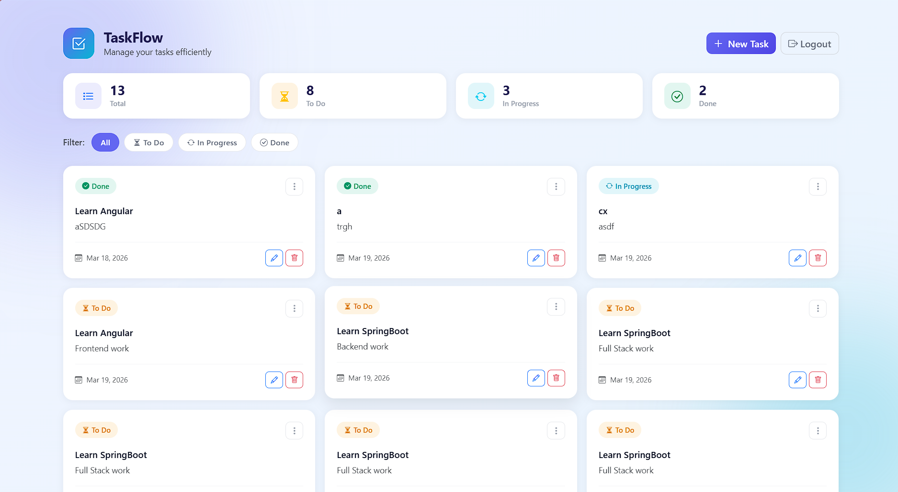

<div align="center">

# TaskFlow

### Full Stack Task Management Application

[](https://spring.io/projects/spring-boot)
[](https://angular.io/)
[](https://www.mysql.com/)
[](https://jwt.io/)
[](https://getbootstrap.com/)

A production-ready full stack Task Manager built with **Spring Boot** REST API and **Angular 17**, secured with **JWT authentication** and styled with **Bootstrap 5**.


</div>

---

## 📌 Overview

TaskFlow is a full stack web application that allows users to securely manage their tasks. Users can register, log in, and perform full CRUD operations on tasks. The application is protected by JWT-based authentication, ensuring only authorized users can access task data.

---




## ✨ Features

- 🔐 **JWT Authentication** — Secure register & login flow with token-based auth
- ✅ **Task CRUD** — Create, view, edit, and delete tasks
- 🎯 **Status Filtering** — Filter tasks by `TO_DO`, `IN_PROGRESS`, `DONE`
- 📊 **Stats Dashboard** — Live task counts by status
- 🛡️ **Route Guards** — Unauthenticated users are redirected to login
- ⚡ **HTTP Interceptor** — JWT token auto-attached to every API request
- 🗑️ **Delete Confirmation** — Modal confirmation before deleting tasks
- 📱 **Responsive UI** — Works on desktop, tablet, and mobile

---

## 🛠️ Tech Stack

### Backend
| Technology | Purpose |
|---|---|
| Java 17 | Programming language |
| Spring Boot 3 | REST API framework |
| Spring Security | Authentication & authorization |
| Spring Data JPA | Database ORM |
| JWT (jjwt) | Token generation & validation |
| MySQL 8 | Relational database |
| Maven | Build tool |

### Frontend
| Technology | Purpose |
|---|---|
| Angular 17 | SPA framework |
| TypeScript | Programming language |
| Bootstrap 5 | UI styling |
| Bootstrap Icons | Icon library |
| Reactive Forms | Form handling & validation |
| Angular Router | Client-side routing |
| HttpClient | REST API communication |

---

## 📁 Project Structure

```
TaskManager/
├── backend/                                  # Spring Boot application
│   ├── src/
│   │   └── main/
│   │       ├── java/com/taskManagement/backend/
│   │       │   ├── controller/
│   │       │   │   ├── AuthController.java   # Register & Login endpoints
│   │       │   │   └── TaskController.java   # Task CRUD endpoints
│   │       │   ├── model/
│   │       │   │   ├── Task.java             # Task entity
│   │       │   │   └── User.java             # User entity
│   │       │   ├── repository/
│   │       │   │   ├── TaskRepository.java
│   │       │   │   └── UserRepository.java
│   │       │   ├── service/
│   │       │   │   └── TaskService.java
│   │       │   └── security/
│   │       │       ├── JwtUtil.java          # JWT generation & validation
│   │       │       ├── JwtFilter.java        # JWT request filter
│   │       │       └── SecurityConfig.java   # Spring Security config
│   │       └── resources/
│   │           └── application.properties
│   └── pom.xml
│
├── frontend/                                 # Angular 17 application
│   ├── src/
│   │   └── app/
│   │       ├── core/
│   │       │   ├── interceptors/
│   │       │   │   └── jwt.ts               # JWT HTTP interceptor
│   │       │   ├── guards/
│   │       │   │   └── auth.guard.ts        # Route auth guard
│   │       │   └── services/
│   │       │       └── task.ts              # Task API service
│   │       ├── features/
│   │       │   ├── auth/
│   │       │   │   ├── login/               # Login page
│   │       │   │   └── register/            # Register page
│   │       │   └── tasks/
│   │       │       ├── models/
│   │       │       │   └── task.model.ts
│   │       │       └── pages/
│   │       │           ├── task-list/       # Task dashboard
│   │       │           └── task-form/       # Add / Edit task
│   │       ├── app.config.ts
│   │       ├── app.routes.ts
│   │       └── app.ts
│   ├── index.html
│   └── package.json
│
└── README.md
```

---

## 🚀 Getting Started

### Prerequisites

Ensure the following are installed on your machine:

- [Java 17+](https://adoptium.net/)
- [Maven 3.8+](https://maven.apache.org/)
- [Node.js 18+](https://nodejs.org/)
- [Angular CLI 17+](https://angular.io/cli) — `npm install -g @angular/cli`
- [MySQL 8+](https://dev.mysql.com/downloads/)

---

### 1. Clone the Repository

```bash
git clone https://github.com/YOUR_USERNAME/task-manager.git
cd task-manager
```

---

### 2. Database Setup

Open MySQL Workbench or your terminal and run:

```sql
CREATE DATABASE taskmanager;
```

---

### 3. Configure the Backend

Open `backend/src/main/resources/application.properties` and update your credentials:

```properties
# Server
server.port=8080

# Database
spring.datasource.url=jdbc:mysql://localhost:3306/taskmanager?useSSL=false&serverTimezone=UTC&allowPublicKeyRetrieval=true
spring.datasource.username=YOUR_MYSQL_USERNAME
spring.datasource.password=YOUR_MYSQL_PASSWORD
spring.datasource.driver-class-name=com.mysql.cj.jdbc.Driver

# JPA / Hibernate
spring.jpa.hibernate.ddl-auto=update
spring.jpa.show-sql=true
spring.jpa.properties.hibernate.dialect=org.hibernate.dialect.MySQLDialect
```

> ✅ Hibernate will auto-create `tasks` and `users` tables on first run.

---

### 4. Run the Backend

```bash
cd backend
mvn clean install
mvn spring-boot:run
```

Backend is running at → **`http://localhost:8080`**

---

### 5. Run the Frontend

Open a new terminal:

```bash
cd frontend
npm install
ng serve
```

Frontend is running at → **`http://localhost:4200`**

---

## 📡 API Documentation

### Base URL
```
http://localhost:8080
```

---

### 🔓 Auth Endpoints (Public)

#### Register
```http
POST /api/auth/register
Content-Type: application/json

{
  "username": "john",
  "password": "secret123"
}
```

#### Login
```http
POST /api/auth/login
Content-Type: application/json

{
  "username": "john",
  "password": "secret123"
}
```

**Response:**
```json
{
  "token": "eyJhbGciOiJIUzI1NiJ9.eyJzdWIiOiJqb2huIn0..."
}
```

---

### 🔒 Task Endpoints (JWT Required)

> All requests must include: `Authorization: Bearer <token>`

| Method | Endpoint | Description |
|--------|----------|-------------|
| `GET` | `/api/v1/tasks` | Get all tasks |
| `GET` | `/api/v1/tasks/{id}` | Get task by ID |
| `POST` | `/api/v1/tasks` | Create new task |
| `PUT` | `/api/v1/tasks/{id}` | Update task |
| `DELETE` | `/api/v1/tasks/{id}` | Delete task |

#### Task Object
```json
{
  "id": 1,
  "title": "Fix login bug",
  "description": "Investigate JWT expiry issue",
  "status": "IN_PROGRESS",
  "createdAt": "2025-03-19T10:30:00"
}
```

#### Status Values
| Value | Description |
|-------|-------------|
| `TO_DO` | Task not yet started |
| `IN_PROGRESS` | Task in progress |
| `DONE` | Task completed |

---

## 🔐 Authentication Flow

```
 Client                          Server
   │                               │
   │──── POST /api/auth/register ─>│
   │<─────────── 200 OK ───────────│
   │                               │
   │──── POST /api/auth/login ────>│
   │<────── { token: "..." } ──────│
   │   store token in localStorage │
   │                               │
   │──── GET /api/v1/tasks ───────>│
   │   Authorization: Bearer ...   │
   │<────── [ tasks array ] ───────│
   │                               │
   │──── Logout ──────────────────>│
   │   remove token from storage   │
```

---

## 🧪 How to Use

| Step | Action |
|------|--------|
| 1 | Visit `http://localhost:4200/register` and create an account |
| 2 | Login at `http://localhost:4200/login` |
| 3 | View your task dashboard with live stats |
| 4 | Click **New Task** to create a task |
| 5 | Use filter pills to filter by status |
| 6 | Use the ⋮ menu on each card to Edit or Delete |
| 7 | Click **Logout** to end your session |

---

## 🐛 Troubleshooting

| Problem | Solution |
|---------|----------|
| `Access Denied` on task API | Ensure you are logged in and token is in `localStorage` |
| `CORS error` in browser | Confirm backend is running on port `8080` |
| Tables not created | Check `ddl-auto=update` in `application.properties` |
| MySQL connection refused | Verify MySQL service is running and credentials are correct |
| Bootstrap not loading | Confirm CDN links exist in `frontend/src/index.html` |
| Tasks not loading after login | Ensure `main.ts` uses `appConfig` so JWT interceptor is active |

---

## 🔒 Security Considerations

> This project is built for demonstration purposes.

For a production deployment:

- [ ] Hash passwords using `BCryptPasswordEncoder`
- [ ] Move JWT secret to environment variables
- [ ] Use HTTPS in production
- [ ] Set token expiry and implement refresh tokens
- [ ] Restrict CORS to specific production domains

---

## 👤 Author

**Aathika**
- GitHub: [@YOUR_USERNAME](https://github.com/Aathi125)

---

## 📄 License

This project was developed as part of an **Internship Selection Assessment**.

---

<div align="center">
  <sub>Built with ❤️ using Spring Boot & Angular</sub>
</div>
